# Differential Fuzzing
## When Implementations Disagree

<div class="absolute bottom-4 right-10">
  
</div>

---
---
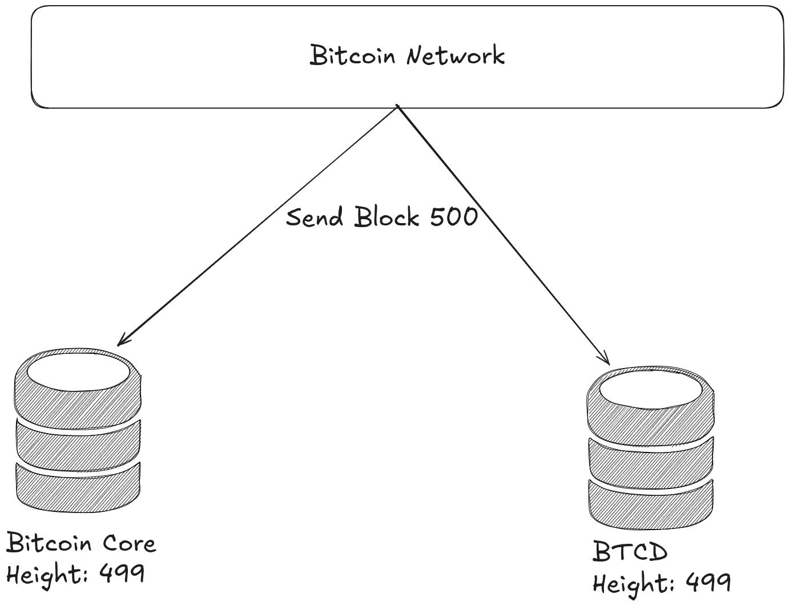
---
---
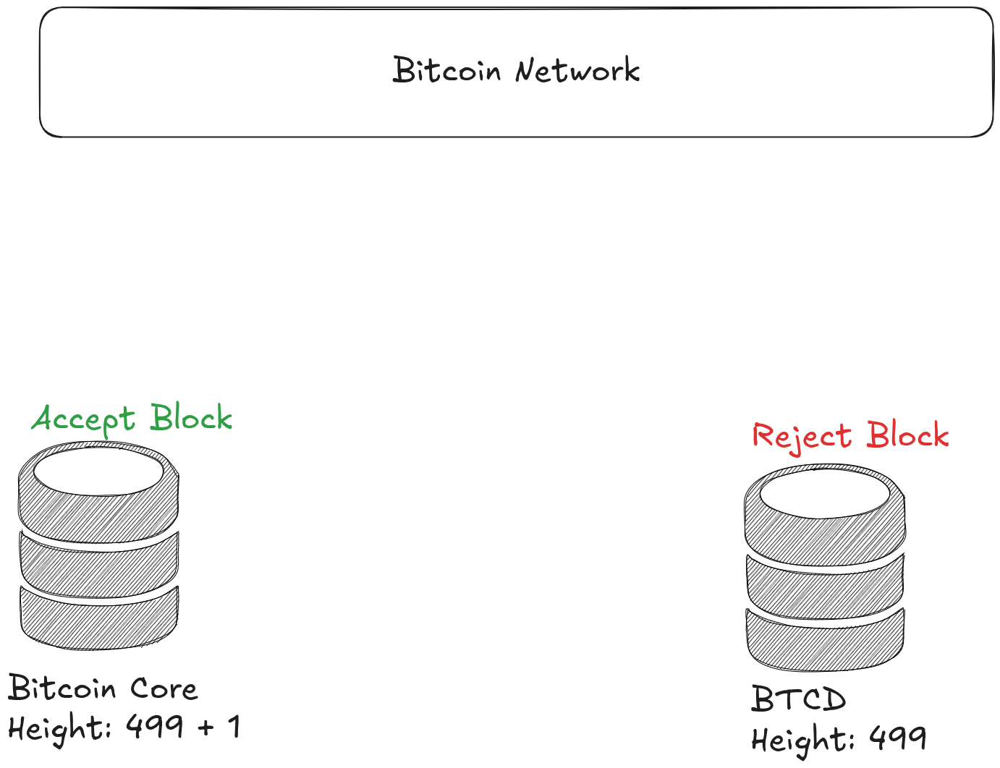
---
---
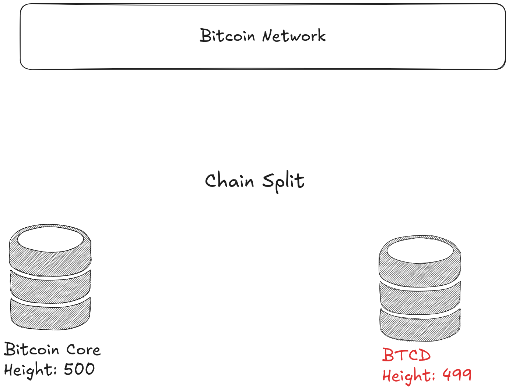
---

## Same Input, Different Behavior

**The problem:**
- Network partitioning
- Double-spend attacks
- Potential Security Issues

**Traditional approach:**
- Wait for users to report bugs
- Manual cross-implementation testing
- Reactive fixes after failures

---
class: flex items-center justify-center text-center
---

# How do we systematically find these discrepancies before they cause problems?

---
class: flex items-center justify-center text-center
---

# Solution: Differential Fuzzing

---

## Who am I?

### Erick Cestari
* Bitcoinfuzz maitainer. 50+ bugs found across Bitcoin libraries
* Security researcher, have made several responsible disclosures.
* Vinteum Grantee

<div class="absolute bottom-4 right-10">
  
</div>
---
---
## Edge Cases
When the spec says `r field should contain one or more entries`.
What happens with zero entries?

This is where implementations diverge:
- Some reject it (Rust-Lightning, Core Lightning)  
- Others accept it (LND, Eclair)

Differential fuzzing systematically explores these specification gaps.

<!--
So here's the core challenge with specifications. Even when they're comprehensive like BOLT, they can't anticipate every possible edge case.

Take this real example from our fuzzing results: The BOLT11 specification says the 'r' field should contain "one or more entries" for routing information. Sounds clear, right?

But what happens when you encounter an 'r' field that exists but contains zero entries? The specification doesn't explicitly address this scenario.

And this is exactly where we see implementations diverge. Rust-Lightning and Core Lightning take a strict interpretation. They reject invoices with empty 'r' fields. Meanwhile, LND and Eclair are more permissive. They accept these invoices.

Neither approach is necessarily wrong. They're just different interpretations of an ambiguous specification.

This is the perfect example of why differential fuzzing is so valuable. Instead of waiting for users to discover these incompatibilities in production, we can systematically generate edge cases like this and find where implementations behave differently. This helps us identify specification gaps before they cause real-world payment failures.
-->
---

## So let's start simple, what is fuzzing?

Fuzzing is an automated software testing technique that involves providing invalid, unexpected, or random data as inputs to a computer program.

<!--
So let's start by fuzzing testing technique. So it's an automated software testing technique that involves providing invalid, unexpected or random data as inputs to a program.
-->
---
class: flex items-center justify-center text-center
---

<div style="transform: scale(1.2);">
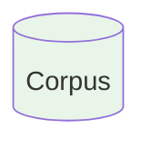
</div>

<!--
The corpus is our starting point. It's a collection of initial seed inputs that will be used to generate test cases.
-->
---
class: flex items-center justify-center text-center
---

<div style="transform: scale(1.2);">
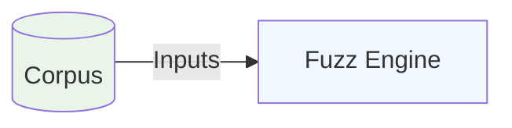
</div>

<!--
The fuzz engine takes inputs from the corpus and is responsible for generating new test cases through mutations.
-->

---
class: flex items-center justify-center text-center
---
<div style="transform: scale(2.2);">
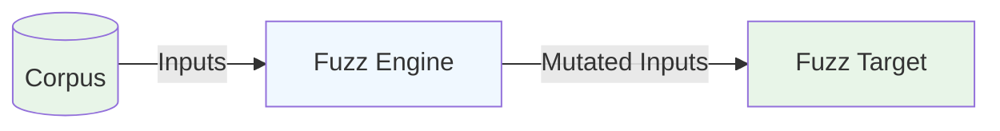
</div>

<!--
The fuzz engine creates mutated inputs and sends them to the fuzz target. The specific part of the program we want to test.
-->
---
class: flex items-center justify-center text-center
---
<div style="transform: scale(3.2);">
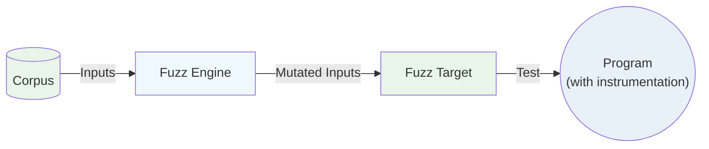
</div>

<!--
The fuzz target executes the program with the mutated inputs. The program is instrumented to collect execution data.
-->

---
class: flex items-center justify-center text-center
---
<div style="transform: scale(3.2);">
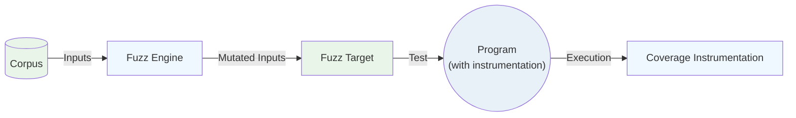
</div>

<!--
During execution, coverage instrumentation tracks which parts of the code are executed, providing feedback.
-->
---
class: flex items-center justify-center text-center
---
<div style="transform: scale(3.2);">
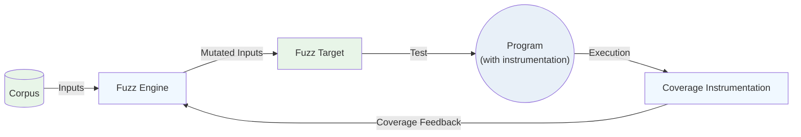
</div>

<!--
The coverage feedback is sent back to the fuzz engine, helping it understand which inputs are discovering new code paths.
-->
---
class: flex items-center justify-center text-center
---

<div style="transform: scale(3.2);">

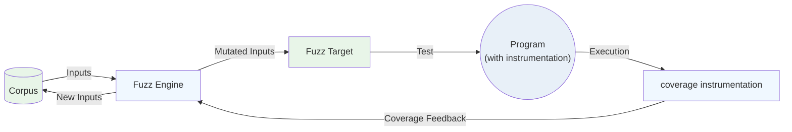
</div>

<!--
When the fuzz engine discovers inputs that lead to new coverage, these are added back to the corpus, creating a continuous improvement cycle.
-->
---
---
## Coverage instrumentation

We use instrumentation to track which code paths are exercised.

It inserts calls to user-defined functions on function-, basic-block-, and edge- levels.

```c
#include <stdio.h>
#include <stdlib.h>

int calculate_grade(int score) {
    if (score >= 90) {
        return 'A';
    } else if (score >= 80) {
        return 'B';
    } else {
        return 'C';
    }
}
```
<!--
Coverage instrumentation provide feedback to the fuzzer by tracking which parts of the code are executed. During compilation, they insert instrumentation calls at various code levels (e.g., functions, basic blocks, edges) to report execution paths. The fuzzer uses this feedback to decide whether a given input explores new behavior and should be retained in the corpus. Below is a simple example function that calculates a grade from a score. We'll use this to compare builds with and without coverage sanitization.
-->
---
---

<!--
This a High Level view of the C code compiled to machine code without coverage instrumentation.
-->
---
---

<!--
This a High Level view of the C code compiled to machine code with coverage instrumentation. We can see that it adds function calls to send coverage information to the fuzzer.
-->
---

## Fuzzing Finds Crashes

What is the problem with this double function?
```rust
use libfuzzer_sys::fuzz_target;

fn double(x: i32) -> i32 {
    x * 2
}

fuzz_target!(|data: &[u8]| {
    if let Some(x) = consume_i32(data) {
        let _ = double(x);
    }
});
```

<!--
This is an example of a bug that fuzzing can find. We have this double function that receives a signed integer 32 bits that then will be multiplied by 2. In this example we can see that the double function doesn't handle overflow, so running the fuzzer we will see that it will crash by overflow.
-->

---
---
## When Fuzzing Gets Stuck

```rust
use libfuzzer_sys::fuzz_target;

fn double(x: i32) -> Option<i32> {
    x.checked_mul(2)
}

fuzz_target!(|data: &[u8]| {
    if let Some(x) = consume_i32(data) {
        let _ = double(x);
    }
});
```

<!--
Now let's try with the function fixed to see what happens. We can see that the fuzzer get stuck because it explored all the code and maximized the coverage and didn't find any crashes.
-->

---
---
## Coverage-Guided Fuzzing in Action

```rust
use libfuzzer_sys::fuzz_target;

fuzz_target!(|data: &[u8]| {
    if data.len() != 6 {
        return;
    }

    if data[0] == b'f' {
        if data[1] == b'u' {
            if data[2] == b'z' {
                if data[3] == b'z' {
                    if data[4] == b'l' {
                        if data[5] == b'n' {
                            panic!("Crash triggered: found the magic sequence!");
                        }
                    }
                }
            }
        }
    }
});
```

<!--
Now let's try with the function fixed to see what happens. We can see that the fuzzer get stuck because it explored all the code and maximized the coverage and didn't find any crashes.
-->

---
---

## Differential Fuzzing

- Generate inputs and feed them simultaneously to **multiple programs**.
- Compare the outputs of the programs to find discrepancies.

<!--
Differential fuzzing will feed two or more programs with the same input and compare those outputs. If they are different outputs the program will crash and save the possible bug.
-->

---
class: flex items-center justify-center text-center
---

<div style="transform: scale(3.2);">

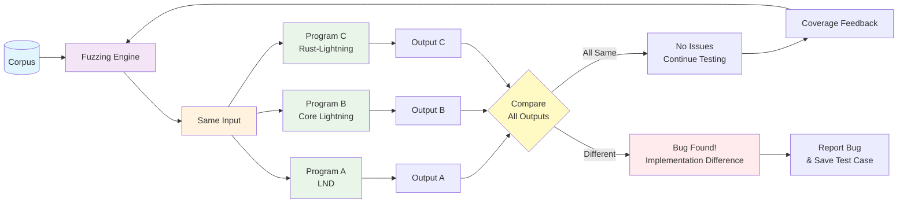
</div>

<!--
This is an overview diagram of differential fuzzing. The outputs can be structured in many different ways. So it could be a boolean type, integer, string, structured formats, etc. It’s important to return the max information possible in the outputs to then be able to catch most/all the discrepancies.
-->
---
---
## Example: Differential Fuzzing

```rust
fn double(x: i32) -> Option<i32> {
    x.checked_mul(2)
}

fn double2(x: i32) -> Option<i32> {
    // Off-by-one: using >= instead of >
    if x >= i32::MAX / 2 || x < i32::MIN / 2 {
        None
    } else {
        Some(x * 2)
    }
}

fuzz_target!(|data: &[u8]| {
    if let Some(x) = consume_i32(data) {
        let res = double(x);
        let res2 = double2(x);
        if res != res2 {panic!("x: {}, res: {:?}, res2: {:?}", x, res, res2);}
    }
});
```

<!--
This is an example of how differential fuzzing catches subtle bugs that regular fuzzing might miss.

We have two functions that are supposed to do the same thing. Double an integer safely. The first function uses Rust's built-in checked_mul which handles overflow correctly.

The second function has a subtle off-by-one error. It uses >= instead of > when checking the bounds. This means it will reject i32::MAX / 2, even though that value can actually be safely doubled.

With regular fuzzing, both functions would work fine and wouldn't crash. But with differential fuzzing, we feed the same input to both functions and compare their outputs.

When the fuzzer generates i32::MAX / 2 as input, the first function returns Some(i32::MAX), but the second function incorrectly returns None. The outputs don't match, so our assertion fails and we've found the bug!

This demonstrates the power of differential fuzzing. It's not looking for crashes, it's looking for inconsistent behavior between implementations that should behave the same way.
-->
---
---

## Bitcoinfuzz: Bitcoin Differential Fuzzing

**What we're building:**
* Differential Fuzzing framework for Bitcoin protocol implementations and libraries
* Focus: Find discrepancies before they cause issues

**Current targets (for lightning network):**

* modules: LND, Core Lightning, Rust-Lightning, Eclair, lightning-kmp
* targets: deserialize_invoice, deserialize_offer, parse_p2p_lightning_message

**Status:** 30 bugs found so far.

<!--
So now let me introduce you to Bitcoinfuzz. This is the practical implementation of differential fuzzing that I've been working on for the Bitcoin ecosystem.

Our goal is simple but powerful: build a comprehensive differential fuzzing framework that can test Bitcoin protocol implementations and libraries against each other to find discrepancies before they hit production.

We're testing five major implementations: LND, which is Go-based and very popular; Core Lightning, the C implementation; Rust-Lightning, obviously written in Rust; Eclair, which is Scala-based; and lightning-kmp, which is a Kotlin multiplatform implementation.

Right now we have two main fuzzing targets. The deserialize_invoice target tests BOLT11 invoice parsing. Like the coffee shop scenario I showed earlier. And deserialize_offer tests the newer BOLT12 offer format.

We've found 30 bugs so far across these implementations. These aren't just theoretical issues; they're real interoperability problems that would affect users trying to make payments between different Lightning implementations.

What's particularly valuable is that we're catching these issues systematically rather than waiting for frustrated users to report them after failed payments.
-->

---
---
## How does Bitcoinfuzz works with different languages?

- Compile with instrumentation (if possible)

LND:
```bash
go build -o liblnd_wrapper.a -buildmode=c-archive -tags=libfuzzer -gcflags=all=-d=libfuzzer wrapper.go
```

rust-lightning:
```bash
RUSTFLAGS="-Z sanitizer=address" cargo rustc --release -- -C passes='sancov-module' \
    -C llvm-args=-sanitizer-coverage-inline-8bit-counters \
    -C llvm-args=-sanitizer-coverage-trace-compares \
    -C llvm-args=-sanitizer-coverage-pc-table \
    -C llvm-args=-sanitizer-coverage-level=4 \
    -C llvm-args=-simplifycfg-branch-fold-threshold=0
```

<!--
One of the biggest challenges in building Bitcoinfuzz is that Lightning implementations are written in different programming languages. Each language has its own compilation model and fuzzing ecosystem, so we need different approaches for each.

For compiled languages like Go and Rust, we can compile with instrumentation to get coverage feedback that guides the fuzzer.

This instrumentation is crucial because it tells the fuzzer which inputs are exploring new code paths. Without it, the fuzzer would just be generating random data with no guidance about what's interesting.

The challenge is that not all languages support this level of instrumentation easily, which brings us to our next slide about interpreted languages.
-->

---
---
## How to fuzz interpreted or VM-based languages?

- Use ffi (foreign function interface)
- For java, use JNI

Eclair:
```cpp
static std::optional<std::string> eclair_decode_invoice(const char* invoiceStr) {
    if (!init_jvm() || !jvm) {
        std::abort();
    }

    JNIEnv* env = nullptr;
    jint status = jvm->GetEnv((void**)&env, JNI_VERSION_1_8);

    jstring jInvoiceStr = env->NewStringUTF(invoiceStr);
    if (!jInvoiceStr) {
        return "";
    }

    jstring jResult = static_cast<jstring>(
        env->CallStaticObjectMethod(decoderClass, decodeMethod, jInvoiceStr)
    );
    env->DeleteLocalRef(jInvoiceStr);
```

<!--
How do we fuzz languages that run on virtual machines or are interpreted, like Java or Scala? These languages don't compile directly to native code with LLVM instrumentation.

The solution is to use Foreign Function Interfaces, FFI. Essentially, we create a bridge between our native fuzzing harness and the VM-based implementation.

For Eclair, which is written in Scala and runs on the JVM, we use JNI, the Java Native Interface. This code snippet shows how we set up that bridge.

First, we initialize the JVM if it's not already running. Then we get a JNI environment handle that lets us interact with Java objects and methods from C++.

We convert our C string input to a Java string object, then call the Scala method that decodes the invoice. Finally, we convert the result back to a C++ string and clean up the Java references to avoid memory leaks.

The downside of this approach is that we lose the coverage instrumentation we get with native compilation. The fuzzer can't see inside the JVM to know which code paths are being exercised. But we can still do differential fuzzing by comparing outputs, we just rely more on structural mutations and less on coverage-guided exploration.

This FFI approach works for any language that can expose a C-compatible interface, whether it's Python, JavaScript, or other VM-based languages.
-->
---
---
## Let's breakdown a target in Bitcoinfuzz

- We need to define at least three things to create a target:

1. Target function
2. Input type
3. Output type
4. Custom mutators (if needed)

<!--
How we actually build a fuzzing target in Bitcoinfuzz. To create an effective differential fuzzing target, we need to define several key components.

First, we need the target function. This is the specific functionality we want to test across different implementations. For example, "deserialize an invoice" or "validate a signature."

Second, we define the input type. This determines what kind of data the fuzzer will generate and feed to our target function. It could be raw bytes, strings, structured data, or protocol-specific formats like BOLT11 invoices.

Third, we need to carefully design the output type. This is crucial for differential fuzzing because we need to compare outputs across implementations. The output should capture as much semantic information as possible, not just "success" or "failure," but the actual parsed data, error codes, or structured results.

Fourth, and this is often the secret sauce, we may need custom mutators. Generic fuzzers are great at flipping random bits, but protocol-specific formats often have checksums, signatures, or encoding schemes that make random mutations mostly invalid. Custom mutators understand the format and can generate more meaningful test cases.

Let me show you how this works in practice with our invoice deserialization target.
-->

---
---
## Example: deserialize_invoice target

1. Input type: BOLT11 invoice string
2. Output type: string containing all the invoice data (e.g., amount, description, etc.)
3. Custom mutators: Bech32 custom mutator

<!--
Let's look at our invoice deserialization target as a concrete example.

Input: BOLT11 invoice strings.

Output: A comprehensive string with all parsed data. Payment hash, amount, description, routing hints, etc. We capture everything, not just success/failure, so we can spot subtle parsing differences between implementations.

Custom mutator: This is the key piece. BOLT11 uses Bech32 encoding with checksums. Random bit flipping creates 99% invalid inputs. Our custom mutator decodes the invoice, mutates the actual data fields meaningfully, then re-encodes with valid checksums. This generates much more interesting test cases that actually exercise the parsing logic.
-->

---
---
## rust-lightning:
```rust
#[no_mangle]
pub unsafe extern "C" fn ldk_des_invoice(input: *const std::os::raw::c_char) -> *mut c_char {
    if input.is_null() {
        return str_to_c_string("");
    }

    // Convert C string to Rust string
    let c_str = match CStr::from_ptr(input).to_str() {
        Ok(s) => s,
        Err(_) => return str_to_c_string(""),
    };

    match Bolt11Invoice::from_str(c_str) { // <-- target function
        Ok(invoice) => {
            if invoice.currency() != Currency::Bitcoin {
                return str_to_c_string("");
            }
            let mut result = String::new(); // <-- output

            result.push_str("HASH=");
            result.push_str(&invoice.payment_hash().to_string());

            result.push_str(";PAYMENT_SECRET=");
            result.push_str(&invoice.payment_secret().to_string());
            ...
```
---
---
## LND:

```go
//export LndDeserializeInvoice
func LndDeserializeInvoice(cInvoiceStr *C.char) *C.char {
	if cInvoiceStr == nil {
		return C.CString("")
	}

	runtime.GC()

	// Convert C string to Go string
	invoiceStr := C.GoString(cInvoiceStr)

	network := &chaincfg.MainNetParams

	invoice, err := zpay32.Decode(invoiceStr, network) // <-- target function
	if err != nil {
		return C.CString("")
	}

	var sb strings.Builder // <-- output

	sb.WriteString("HASH=")
	if invoice.PaymentHash != nil {
		sb.WriteString(fmt.Sprintf("%x", *invoice.PaymentHash))
	}
    ...
```
---
---
## Custom mutator

- BOLT 11 invoice have checksums that are calculated from the data.
- So we need to mutate the data and recompute the checksum.

<div style="transform: scale(1);">

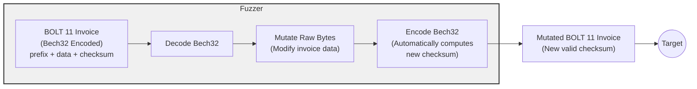
</div>

<!--
This diagram shows why custom mutators are essential for protocol fuzzing. BOLT11 invoices have checksums, if you flip random bits, the checksum becomes invalid and implementations reject the input immediately.

Our custom mutator is smarter: it decodes the Bech32 format first, mutates the actual invoice data, then re-encodes with a fresh, valid checksum. This way we generate inputs that pass basic validation and actually exercise the parsing logic.

Without this approach, we'd just be testing input validation over and over. With it, we can mutate amounts, descriptions, routing hints, and other semantic fields while keeping the invoice structurally valid. This generates much more interesting test cases that reveal implementation differences in how they handle edge cases in the actual data.
-->
---
---
## Compare the outputs

```cpp
void Driver::InvoiceDeserializationTarget(std::span<const uint8_t> buffer) const {
    std::string invoice = ConsumeString(buffer);
    std::optional<std::string> first_result;
    
    // Test each Lightning implementation
    for (auto &implementation : implementations) {
        auto result = implementation->deserialize_invoice(invoice);
        
        if (first_result.has_value()) {
            // Compare with previous result
            if (result != first_result) {
                std::cout << "DISCREPANCY FOUND!" << std::endl;
                std::cout << "Invoice: " << invoice << std::endl;
                std::cout << "Implementation A: " << first_result.value() << std::endl;
                std::cout << "Implementation B: " << result.value() << std::endl;
                
                // This assertion will crash and save the test case
                assert(result == first_result);
            }
        } else {
            first_result = result;
        }
    }
}
```
---
class: flex items-center justify-center text-center
---

# Let's run Bitcoinfuzz!

---
---
## So what bugs have we found so far?

1. LND: lightningnetwork/lnd#9591
1. Core Lightning: ElementsProject/lightning#8219
1. LND: lightningnetwork/lnd#9808
1. Core Lightning: ElementsProject/lightning#8282
1. bolts: lightning/bolts#1264
1. rust-lightning: lightningdevkit/rust-lightning#3814
1. LND: lightningnetwork/lnd#9904
1. LND: lightningnetwork/lnd#9915
1. Eclair: ACINQ/eclair#3104
1. lightning-kmp: ACINQ/lightning-kmp#799
1. lightning-kmp: ACINQ/lightning-kmp#801
1. lightning-kmp: ACINQ/lightning-kmp#802
1. rust-lightning: lightningdevkit/rust-lightning#3998
1. bolts: lightning/bolts#1279
1. rust-lightning: lightningdevkit/rust-lightning#4018

---
---

## Improved signature specification in BOLT11

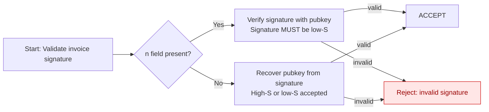

---
---
## C-Lightning accepting invalid invoices

C-Lightning was accepting invoices with routing hints without validating the public key format.


---
---
## Doing differential fuzzing of projects that do not have fuzz testing

Some projects do not have support for fuzzing or do not run their fuzz targets continuously. It means that we could find bugs not because of the
"differential" thing, but simply because the project has not been fuzzed. 


---
---

## How to Contribute to **Bitcoinfuzz**

- **Add new targets** (BIP32 key derivations, secp256k1, etc.)
- **Add new libraries** (bolt11.js, bitcoinj, libbitcoin)
- **Build system improvements**
- **Run bitcoinfuzz!**

<div class="absolute bottom-4 right-10">
  
</div>

---
class: flex flex-col items-center text-center h-full
---

<div class="flex-1 flex items-center justify-center">

# Thank You!

</div>

<div>
erickcestari03@gmail.com
</div>
<div>
github.com/erickcestari
</div>

<div class="absolute bottom-4 right-10">
  
</div>